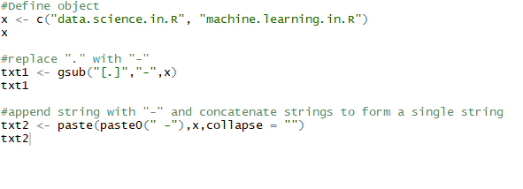

# Assignment-4.2
assignments for Acadgild Data Science with R course

x <- c(‘data.science.in.R’, ‘machine.learning.in.R’)
Perform the below string Operation:
• Replace the period character "." within each string with another character i.e. "-" minus sign.
• Append again with “-“ minus sign character at the start of the each string and finally concatenate all the
string within the vector to form a final single string and assigning it the object.

code:

    
    
 solution:
 
 
 
